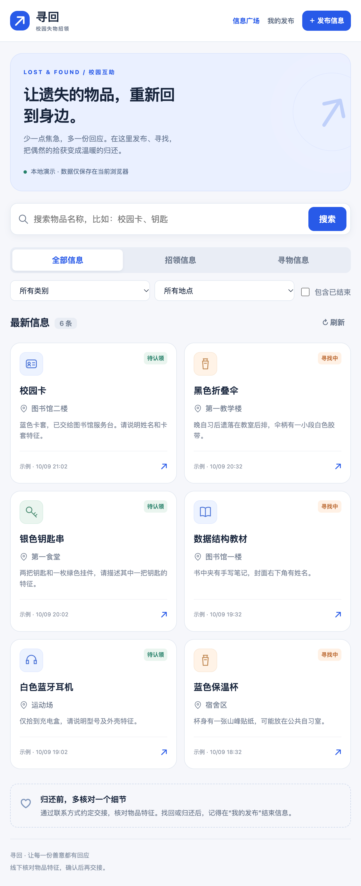
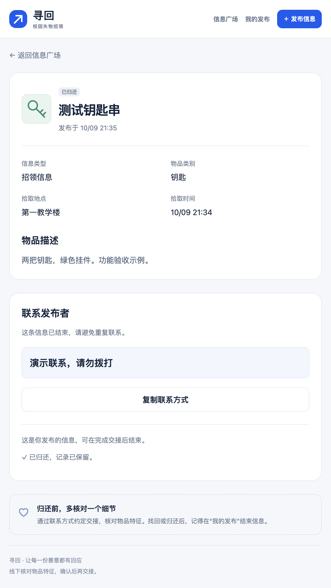
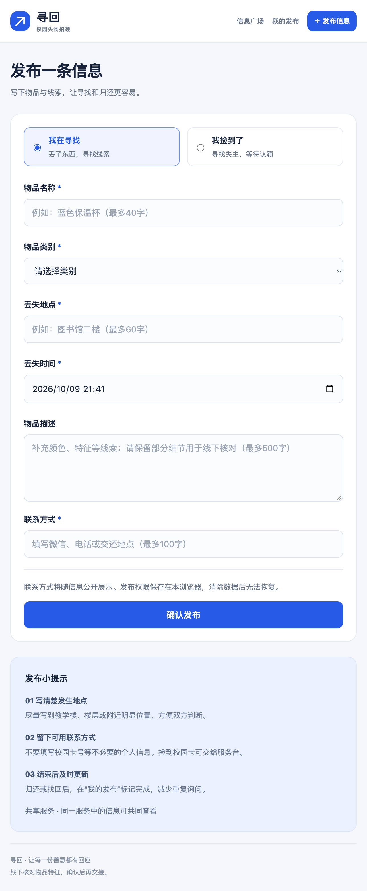

# 寻回 · 校园失物招领

软件工程第二次结对作业（程序实现）。基于第一次结对作业的 Figma 原型，提供寻物和招领发布、浏览、名称搜索、详情及联系方式、我的发布、结束信息等功能。

- 102302152 戴锴斌：[博客](https://www.cnblogs.com/dkb0704)
- 072308214 周兴宇：[博客](https://www.cnblogs.com/WetDryGarbage)
- [作业要求](https://edu.cnblogs.com/campus/fzu/2026-01SoftwareEngineeringandSoftwareEngineeringPractice/homework/16745)
- [原型及需求博客](https://www.cnblogs.com/dkb0704/p/23134757)
- [周兴宇的测试计划评审 PR #1](https://github.com/dkb0704/102302152-072308214/pull/1)

## 运行方法一：直接打开（最方便验收）

1. 点击仓库绿色 **Code → Download ZIP**，完整解压。
2. 用 **Google Chrome** 打开解压目录中的 `index.html`。无需安装任何依赖、无需联网。
3. 初次打开带有6条明确标注的示例信息。点击卡片可看详情，使用“发布信息”新增自己的记录。
4. 新记录出现在“我的发布”，详情页可以确认“已找回”或“已归还”；默认首页隐藏已结束信息，勾选“包含已结束”可查看。

此模式的数据仅保存在当前浏览器，不与其他设备共享。请固定文件位置，用普通 Chrome 窗口测试；访客／无痕窗口关闭后数据会清除。复制文件到另一处可能形成另一份本地数据。示例记录不是你的发布，不能修改它们的状态；请先自己新增记录。

## 运行方法二：共享服务（验证多浏览器）

需要 **Python 3.9 或以上**，仅用标准库，无需 pip 安装。在项目目录打开终端：

```sh
python3 server.py
```

Windows 如果 `python3` 不可用，使用 `py -3 server.py` 或 `python server.py`。

在 Chrome 打开 **http://127.0.0.1:8000**。初次共享版列表为空，请自行发布测试信息；数据存到 `data/campus.sqlite`，重启服务保留。按 Ctrl+C 停止。

- 端口占用：`python3 server.py --port 8765`，然后访问相应端口。
- 验证多人：普通窗口发布，用无痕窗口访问同一地址；后者能看到信息，但不能修改前者状态。发布者结束后，其他窗口刷新即可看到结果。
- 课堂局域网演示：`python3 server.py --host 0.0.0.0`，其他设备用服务器电脑的局域网 IP 访问。只用于可信课堂网络；默认监听本机，未部署公网服务。
- 请使用项目自带服务，普通静态文件服务器不提供 `/api/posts`，会显示接口格式错误。
- 两种运行方式的数据互不自动同步。

## 身份和联系方式说明

项目不要求登录或实名认证。首次进入时生成随机的本浏览器管理凭证；共享版仅在服务器保存其哈希。**管理权限绑定浏览器，不等于确认学生身份。** 换浏览器、清除网站数据或丢失凭证后不能管理原来的记录，本版没有凭证找回功能。

共享版的修改权限由服务端校验，不能通过只改页面按钮获得权限。本地演示版的数据可被本机开发工具改写，不作为真实权限安全系统。

联系方式由发布者主动公开，支持微信、电话或物品交还地点。请勿填写不必要的个人资料。软件只展示／复制联系方式，实际联系和物品核对在线下进行。

## 功能与规则

- 必填项去除首尾空白；名称40字、地点60字、联系方式100字、描述500字上限。
- 发生时间不得在未来；无效日期和异常字符会被拒绝。失败时保留表单。
- 搜索物品名称包含关键词，忽略英文大小写和首尾空白；全空白不搜索。
- 类别、地点与寻物／招领类型可组合筛选。列表按发布时间倒序。
- **附加特点一**：按类别和地点筛选，缩小范围。
- **附加特点二**：一键复制联系方式，复制失败时选中文本供手动复制。
- 寻物：寻找中 → 已找回；招领：待认领 → 已归还。只允许发布者确认结束，取消不保存，结束后不支持重新打开。
- 页面错误不自动退回另一份数据；存储损坏或保存失败会提示，避免误以为发布成功。

## 目录

```text
index.html               页面入口与确认弹窗
assets/
  app.js                 页面、路由、表单和交互
  core.js                输入校验、查询、状态规则
  store.js               浏览器存储与HTTP适配器
  styles.css             响应式样式
  favicon.svg            本地矢量图标
server.py                可选共享服务、SQLite与权限校验
package.json             前端测试命令（无第三方依赖）
tests/
  core.test.js           业务规则测试
  store.test.js          保存、恢复及错误处理测试
  ui-state.test.js       异步旧请求回归测试
  test_server.py         HTTP与SQLite集成测试
docs/
  实现说明.md            关键实现和流程图
  测试报告.md            测试方法、结果与限制
  开发记录.md            编码前估算及实际过程证据
  evidence/              测试输出与Chrome真实截图
  superpowers/           设计和实施计划
测试计划.txt             周兴宇通过PR评审的验收计划
data/                    运行自动生成，不提交到GitHub
```

## 自动化测试

运行页面不需要 Node。仅执行前端测试时需要 Node.js 18 或以上：

```sh
npm test
python3 -m unittest discover -s tests -v
```

也可以直接执行 `node --test tests/*.test.js`。前端 **27项**、共享服务 **13项**测试均通过，具体记录见[测试报告](docs/测试报告.md)。Python测试使用临时数据库和本机临时端口，不修改正常运行的数据；每次结束会清理。

## 页面截图

以下是实际 Chrome 页面截图，示例数据不代表真实失物。





## 当前交付范围

首版程序、自动化测试和开发者浏览器验收已准备。两位同学的独立试用反馈、周兴宇的后续测试代码PR、个人实际PSP与博客最终提交仍应按实际完成情况补齐，不能将本仓库的自动测试替代真实同学反馈。
