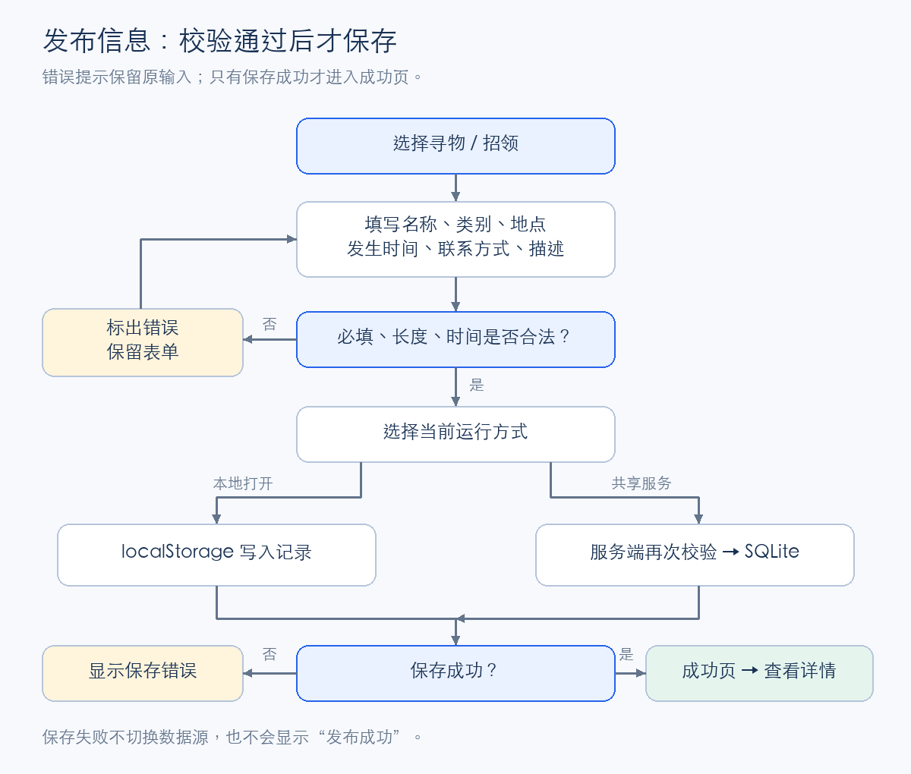
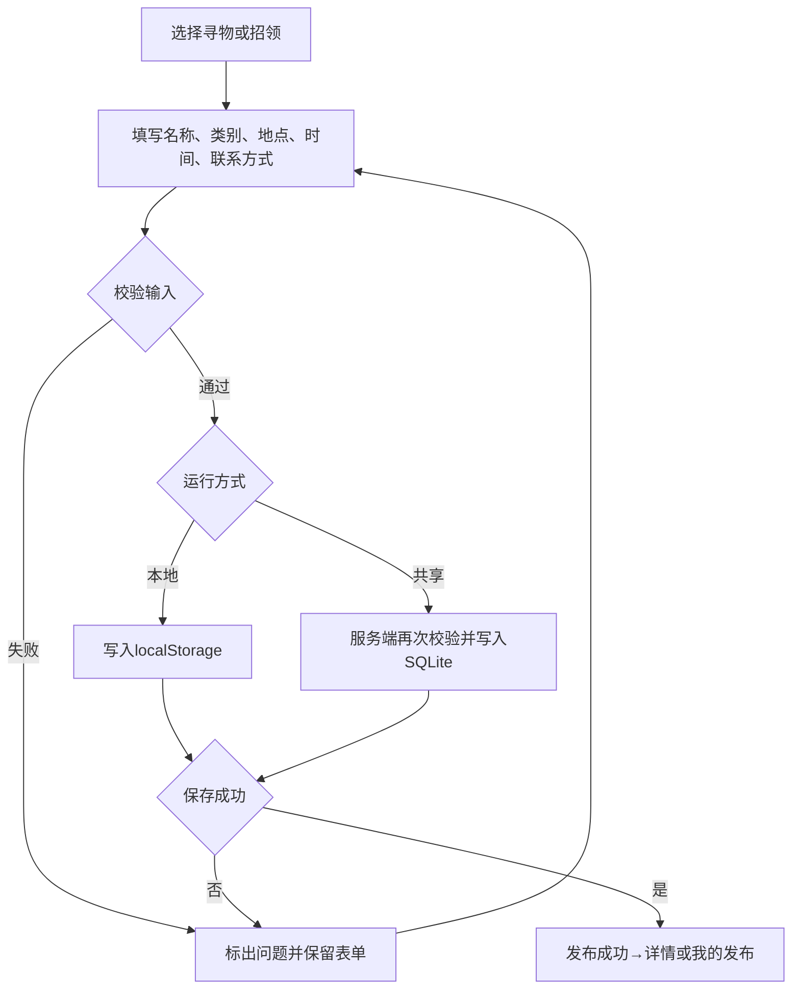
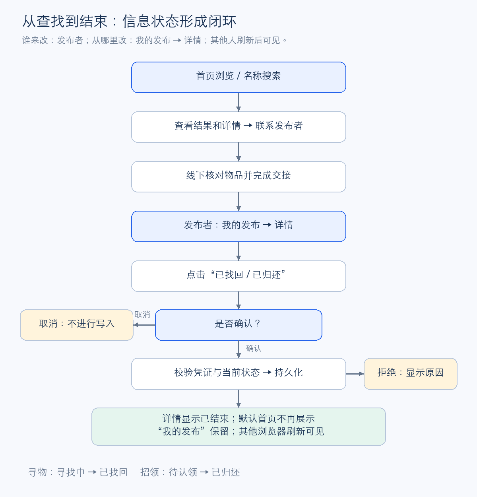
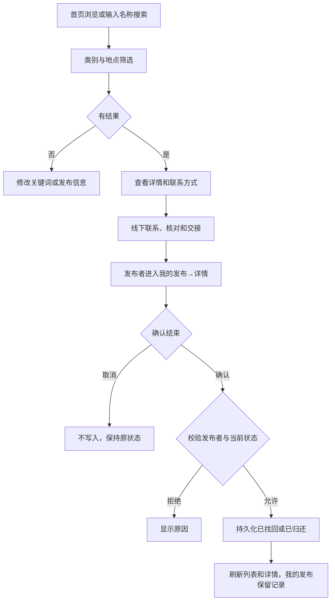
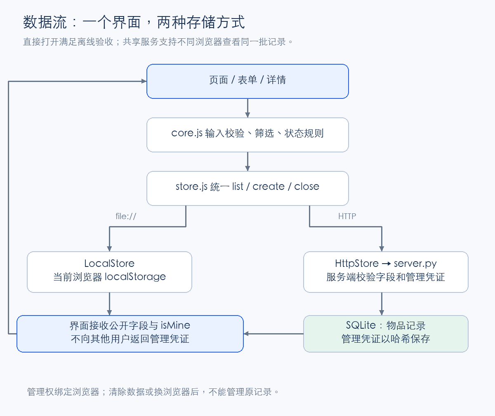
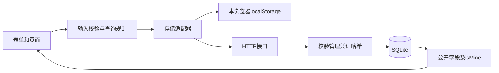

# 实现说明

## 从原型到程序

延续首页、发布、搜索、详情、我的发布，补上真实输入、持久化和权限校验。原型的固定跳转改为根据实际记录渲染。首版用原生网页而不是框架，是为了让助教下载后直接用 Chrome 打开 HTML。

纯本地存储不能支持同学之间的信息共享，因此额外提供 Python 标准库共享服务。界面调用统一的 list/create/close 方法，运行于 file 协议时选择 LocalStore，运行于 HTTP 时选择 HttpStore。失败时只报错，不切换数据源。

## 发布流程





## 查找与结束流程





## 数据流与权限





每条记录保存物品字段、状态和发布时间；共享服务另存 ownerHash。响应仅含公开字段和当前访问者的 isMine，其他浏览器不收到管理凭证。服务器的更新路径先开启事务，再检查记录存在、凭证匹配、状态仍进行中，最后更新。即使直接请求接口，也不能越权结束他人记录。

```python
if not hmac.compare_digest(row['ownerHash'], self.digest(key)):
    return 403, {'error': '只有发布者可以修改状态'}
if row['status'] != 'active':
    return 409, {'error': '这条信息已经结束'}
```

取消确认没有调用 store.close，所以不会产生写操作。确认按钮等待期间禁用，服务端再次拒绝重复结束。浏览器管理凭证只用于简化课程演示，不是学生身份验证。

## 筛选与复制

名称先 trim，再进行不区分英文大小写的包含匹配；类别和地点条件同时成立才保留。默认不展示已结束记录，我的发布始终保留全部状态。类别、地点筛选解决“名称相似时列表太多”的问题；复制联系方式减少手动输入。

用户内容统一由 textContent 写入页面，物品描述中的尖括号只作为文本显示。图标是代码中的固定 SVG，不把用户输入拼接进 HTML。剪贴板写入只有成功后才提示已复制；失败时选中可见文本并提示手动复制。

## 本次实际排查

1. 代码审查发现，旧列表请求在完成新请求之后返回时，会先覆盖 state.items，再判断请求序号。界面当时没重绘，但下一次筛选会使用旧数据。用两个可控制完成顺序的 Promise 复现后，改为先比较请求序号，再写入数据。回归测试保留在 ui-state.test.js。
2. Python 日期解析会把 +00:99 时区偏移自动规范化；JavaScript 不接受这个输入。补充偏移小时／分钟范围校验，接口现在返回400。
3. JSON可以携带孤立的Unicode代理字符；插入SQLite时曾抛编码异常。服务端及前端增加无效字符检查，保留相应回归测试。
4. 键盘“跳到主要内容”链接原先会触发哈希路由。改为阻止默认导航并聚焦main，避免进入不存在页面。

这些是开发与审查中的实际问题；没有把它们写成两位同学之间未发生的讨论。
